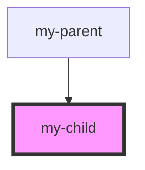

# my-child

<!-- Auto Generated Below -->

## Dependencies

### Used by

 - [my-parent](../my-parent)

### Graph

----------------------------------------------

*Built with [StencilJS](https://stenciljs.com/)*
