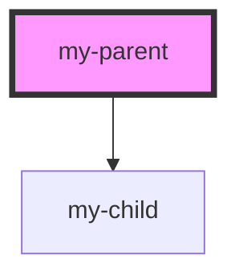

# my-parent

<!-- Auto Generated Below -->

## Dependencies

### Depends on

- [my-child](../my-child)

### Graph

----------------------------------------------

*Built with [StencilJS](https://stenciljs.com/)*
